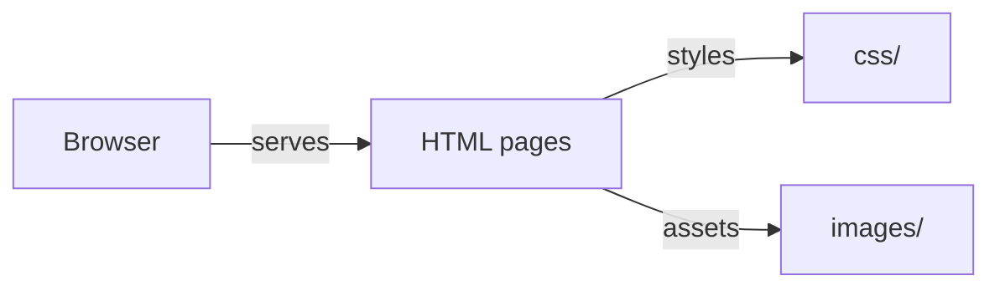

# Sepatukeren

Static website deployed on GitHub Pages. Built with HTML and CSS.

## Overview

A lightweight static website with minimal dependencies.

## Core Architecture



## System Components

| Component | Responsibility |
|---|---|
| `index.html` | Entry page |
| `css/` | Stylesheets |
| `images/` | Image assets |

## Technology Stack

| Layer | Technology | Purpose |
|---|---|---|
| Structure | HTML5 | Page markup |
| Styling | CSS3 | Visual design |

## Requirements

- Any modern web browser
- No build step

## Getting Started

```bash
git clone <repo-url>
cd Sepatukeren
open index.html
```
